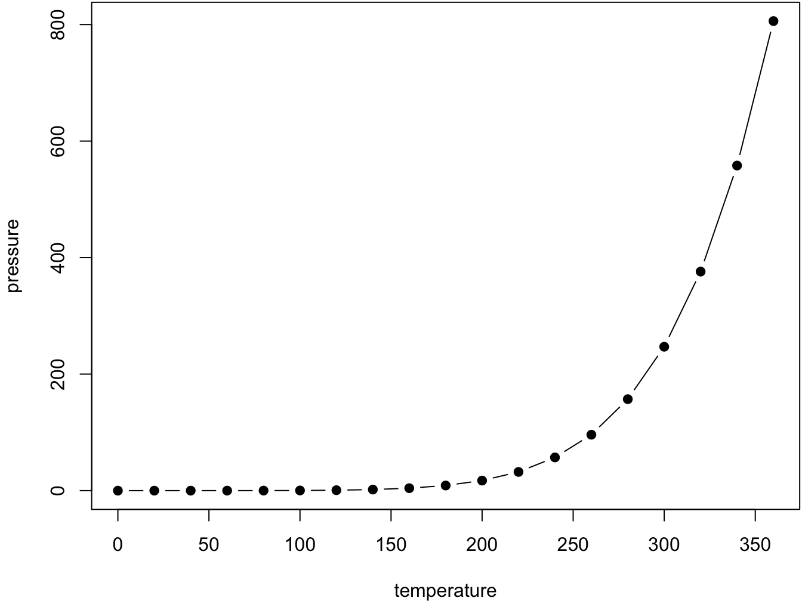

--- 
title: "Desenvolvimento web Avançado"
author: "Juliana Costa Silva"
date: "2026-03-17"
site: bookdown::bookdown_site
documentclass: book
bibliography: [book.bib, packages.bib]
# url: your book url like https://bookdown.org/yihui/bookdown
# cover-image: path to the social sharing image like images/cover.jpg
description: |
  This is a minimal book of using the bookdown package to write a book.
  The HTML output format for this example is bookdown::bs4_book,
  set in the _output.yml file.
biblio-style: apalike
csl: chicago-fullnote-bibliography.csl
---

# About

This is a _sample_ book written in **Markdown**. You can use anything that Pandoc's Markdown supports; for example, a math equation $a^2 + b^2 = c^2$.

## Usage 

Each **bookdown** chapter is an .Rmd file, and each .Rmd file can contain one (and only one) chapter. A chapter *must* start with a first-level heading: `# A good chapter`, and can contain one (and only one) first-level heading.

Use second-level and higher headings within chapters like: `## A short section` or `### An even shorter section`.

The `index.Rmd` file is required, and is also your first book chapter. It will be the homepage when you render the book.

## Render book

You can render the HTML version of this example book without changing anything:

1. Find the **Build** pane in the RStudio IDE, and

1. Click on **Build Book**, then select your output format, or select "All formats" if you'd like to use multiple formats from the same book source files.

Or build the book from the R console:


``` r
bookdown::render_book()
```

To render this example to PDF as a `bookdown::pdf_book`, you'll need to install XeLaTeX. You are recommended to install TinyTeX (which includes XeLaTeX): <https://yihui.org/tinytex/>.

## Preview book

As you work, you may start a local server to live preview this HTML book. This preview will update as you edit the book when you save individual .Rmd files. You can start the server in a work session by using the RStudio add-in "Preview book", or from the R console:


``` r
bookdown::serve_book()
```


<!--chapter:end:index.Rmd-->

# JavaScript Básico para Node.js

**Disciplina:** Desenvolvimento Web Avançado\
**Contexto:** Programação Back-end com Node.js\
**Data:** 10/03/2026

------------------------------------------------------------------------

## 1. O que é JavaScript no contexto do Node.js {-}

JavaScript é uma linguagem de programação originalmente criada para execução em navegadores.\
Com o **Node.js**, o JavaScript também pode ser executado **no servidor**, permitindo o desenvolvimento de aplicações back-end.

Em Node.js, scripts JavaScript são executados diretamente pelo interpretador:

``` bash
node arquivo.js
```

Exemplo simples:

``` javascript
console.log("Hello Node.js");
```

------------------------------------------------------------------------

## 2. Declaração de Variáveis {-}

JavaScript possui três formas principais de declarar variáveis:

| Palavra-chave | Escopo | Observação                       |
|---------------|--------|----------------------------------|
| `var`         | função | legado, evitar em código moderno |
| `let`         | bloco  | variável mutável                 |
| `const`       | bloco  | valor constante                  |

Exemplo:

``` javascript
let nome = "Ana";
const idade = 20;

console.log(nome);
console.log(idade);
```

Boa prática:

-   usar **const por padrão**
-   usar **let quando o valor precisa mudar**

------------------------------------------------------------------------

## 3. Tipos de Dados  {-}

JavaScript é **dinamicamente tipada**, ou seja, o tipo é definido em tempo de execução.

Tipos primitivos principais:

| Tipo      | Exemplo                      |
|-----------|------------------------------|
| string    | `"Olá"`                      |
| number    | `10`, `3.14`                 |
| boolean   | `true`, `false`              |
| null      | ausência de valor            |
| undefined | variável declarada sem valor |

Exemplo:

``` javascript
let nome = "Carlos";
let idade = 30;
let ativo = true;

console.log(typeof nome);
console.log(typeof idade);
console.log(typeof ativo);
```

------------------------------------------------------------------------

## 4. Operadores Matemáticos {-}

| Operador | Descrição        |
|----------|------------------|
| `+`      | soma             |
| `-`      | subtração        |
| `*`      | multiplicação    |
| `/`      | divisão          |
| `%`      | resto da divisão |
| `**`     | potência         |

Exemplo:

``` javascript
let a = 10;
let b = 3;

console.log(a + b);
console.log(a % b);
console.log(a ** 2);
```

------------------------------------------------------------------------

## 5. Operadores Relacionais  {-}

| Operador | Significado                     |
|----------|---------------------------------|
| `>`      | maior                           |
| `<`      | menor                           |
| `>=`     | maior ou igual                  |
| `<=`     | menor ou igual                  |
| `==`     | igualdade (com coerção de tipo) |
| `===`    | igualdade estrita               |

Exemplo:

``` javascript
let x = 10;
let y = "10";

console.log(x == y);
console.log(x === y);
```

Boa prática: usar **sempre `===`**.

------------------------------------------------------------------------

## 6. Operadores Lógicos {-}

| Operador          | Significado |     |     |
|-------------------|-------------|-----|-----|
| `&&`              | AND         |     |     |
| `|             |` | OR          |     |     |
| `!`               | NOT         |     |     |

Exemplo:

``` javascript
let idade = 20;
let possuiCarteira = true;

if (idade >= 18 && possuiCarteira) {
    console.log("Pode dirigir");
}
```

------------------------------------------------------------------------

## 7. Estruturas Condicionais {-}

### if / else

``` javascript
let idade = 18;

if (idade >= 18) {
    console.log("Maior de idade");
} else {
    console.log("Menor de idade");
}
```

------------------------------------------------------------------------

### switch {-}

``` javascript
let dia = 2;

switch(dia){
    case 1:
        console.log("Segunda");
        break;
    case 2:
        console.log("Terça");
        break;
    default:
        console.log("Outro dia");
}
```

------------------------------------------------------------------------

## 8. Estruturas de Repetição {-}

### for {-}

``` javascript
for (let i = 0; i < 5; i++) {
    console.log(i);
}
```

------------------------------------------------------------------------

### while {-}

``` javascript
let i = 0;

while (i < 5) {
    console.log(i);
    i++;
}
```

------------------------------------------------------------------------

### for...of (muito comum em JavaScript) {-}

``` javascript
let numeros = [1,2,3,4];

for (let n of numeros) {
    console.log(n);
}
```

------------------------------------------------------------------------

## 9. Funções {-}

Funções podem ser declaradas de várias formas.

### Função tradicional

``` javascript
function soma(a, b){
    return a + b;
}

console.log(soma(5,3));
```

------------------------------------------------------------------------

### Arrow Function {-}

Muito utilizada em aplicações Node.js modernas.

``` javascript
const soma = (a, b) => {
    return a + b;
};
```

Versão reduzida:

``` javascript
const soma = (a,b) => a + b;
```

[Leia mais sobre arrow functions](aula2_arrow_function.md)

------------------------------------------------------------------------

## 10. Arrays {-}

Arrays armazenam coleções de valores.

``` javascript
let numeros = [10, 20, 30];

console.log(numeros[0]);
```

Iteração:

``` javascript
for (let n of numeros) {
    console.log(n);
}
```

------------------------------------------------------------------------

## 11. Objetos {-}

Objetos são estruturas chave-valor.

``` javascript
let usuario = {
    nome: "Ana",
    idade: 25,
    ativo: true
};

console.log(usuario.nome);
```

Iteração:

``` javascript
for (let chave in usuario){
    console.log(chave, usuario[chave]);
}
```

------------------------------------------------------------------------

## 12. Template Strings {-}

Permitem interpolação de variáveis.

``` javascript
let nome = "João";
let idade = 30;

console.log(`Nome: ${nome}, Idade: ${idade}`);
```

------------------------------------------------------------------------

## 13. Módulos no Node.js {-}

Node.js utiliza **módulos** para organizar código.

## Exportando

``` javascript
function soma(a,b){
    return a+b;
}

module.exports = soma;
```

------------------------------------------------------------------------

### Importando {-}

``` javascript
const soma = require('./soma');

console.log(soma(2,3));
```

------------------------------------------------------------------------

## Boas práticas iniciais {-}

-   utilizar **const sempre que possível**
-   preferir **=== em vez de ==**
-   usar **arrow functions**
-   manter funções pequenas
-   organizar código em **módulos**

------------------------------------------------------------------------

## Executando programas Node.js {-}

Estrutura típica:

```         
projeto/
 ├── index.js
 ├── utils.js
 └── package.json
```

Executar:

``` bash
node index.js
```

------------------------------------------------------------------------

## Próximos conceitos importantes em Node.js {-}

Após dominar a sintaxe básica, os próximos tópicos normalmente incluem:

-   JSON
-   manipulação de arquivos
-   módulos NPM
-   criação de servidores HTTP
-   Express
-   APIs REST
-   acesso a banco de dados

------------------------------------------------------------------------

# Atividade em Sala — Desafio JavaScript (Node.js)

**Disciplina:** Desenvolvimento Web Avançado\

------------------------------------------------------------------------

## Desafio: Construindo um Mini Processador de Dados {-}

Você recebeu um conjunto de dados simulando registros de usuários de um sistema.

``` javascript
const usuarios = [
  { nome: "Ana", idade: 20, ativo: true, compras: [100, 50, 25] },
  { nome: "Bruno", idade: 17, ativo: false, compras: [30, 20] },
  { nome: "Carlos", idade: 32, ativo: true, compras: [200, 150, 50, 100] },
  { nome: "Diana", idade: 25, ativo: true, compras: [] },
  { nome: "Eduardo", idade: 15, ativo: false, compras: [10] }
];
```

Seu objetivo é desenvolver um **script Node.js** que processe esses dados e gere relatórios.

------------------------------------------------------------------------

## Parte 1 — Total de Compras por Usuário {-}

Utilizando **arrow functions**, calcule o valor total de compras de cada usuário.

Resultado esperado:

```         
Ana: total = 175
Bruno: total = 50
Carlos: total = 500
Diana: total = 0
Eduardo: total = 10
```

------------------------------------------------------------------------

## Parte 2 — Usuários Ativos {-}

Utilizando **arrow functions**, filtre apenas os usuários que estão **ativos**.

Resultado esperado:

```         
Ana
Carlos
Diana
```

------------------------------------------------------------------------

## Parte 3 — Usuários Maiores de Idade {-}

Liste apenas usuários com **idade \>= 18**.

Utilize **arrow functions**.

------------------------------------------------------------------------

## Parte 4 — Usuário com Maior Volume de Compras {-}

Determine qual usuário possui o **maior total de compras**.

Resultado esperado (aproximado):

```         
Usuário com maior volume: Carlos
Total: 500
```

------------------------------------------------------------------------

## Parte 5 — Desafio de Coerção de Tipos {-}

Analise o seguinte código:

``` javascript
console.log("5" + 2);
console.log("5" - 2);
console.log(true + 1);
console.log(false == 0);
console.log(false === 0);
```

Explique **por que cada resultado ocorre**.

Dica: pesquise sobre **coerção de tipos em JavaScript**.

------------------------------------------------------------------------

## Parte 6 — Desafio Arrow Function vs Function {-}

Observe os dois códigos:

### Código 1

``` javascript
const pessoa = {
  nome: "Maria",
  falar: function(){
    console.log(this.nome);
  }
};

pessoa.falar();
```

### Código 2

``` javascript
const pessoa = {
  nome: "Maria",
  falar: () => {
    console.log(this.nome);
  }
};

pessoa.falar();
```

Execute os dois exemplos e responda:

1.  Qual deles funciona corretamente?
2.  Por que o outro não funciona?
3.  Qual é o comportamento de `this` em arrow functions?

------------------------------------------------------------------------

## Parte 7 — Desafio Final {-}

Crie uma função chamada `gerarRelatorio`.

Ela deve retornar um objeto contendo:

```         
{
 totalUsuarios: X,
 usuariosAtivos: X,
 usuariosInativos: X,
 mediaIdade: X,
 maiorComprador: "nome"
}
```

Utilize **arrow functions sempre que possível**.

Exemplo de saída:

``` javascript
{
 totalUsuarios: 5,
 usuariosAtivos: 3,
 usuariosInativos: 2,
 mediaIdade: 21.8,
 maiorComprador: "Carlos"
}
```

------------------------------------------------------------------------

## Regras do Desafio {-}

-   Utilize **arrow functions sempre que possível**
-   Utilize **arrays e objetos**
-   Utilize **console.log para exibir os resultados**
-   Não utilizar bibliotecas externas

------------------------------------------------------------------------

## Desafio Extra (para quem terminar antes) {-}

Implemente uma função que retorne:

-   o **usuário mais jovem**
-   o **usuário mais velho**
-   o **valor médio das compras por usuário**

Utilizando **arrow functions e métodos de array**.

------------------------------------------------------------------------

<!--chapter:end:02-aula2_conteudo.Rmd-->

# Arrow Functions em JavaScript

As **Arrow Functions** são uma forma mais concisa de declarar funções em JavaScript.  
Elas foram introduzidas no **ECMAScript 6 (ES6)** e são amplamente utilizadas em aplicações modernas, especialmente em projetos **Node.js**.

Seu principal objetivo é:

- reduzir a verbosidade da sintaxe
- tornar funções mais expressivas
- facilitar o uso de funções como argumentos (callbacks)
- preservar o contexto de `this`

---

## Funções tradicionais em JavaScript {-}

Antes do ES6, a forma mais comum de declarar funções era:


``` javascript
function soma(a, b) {
    return a + b;
}
```

Uso:


``` javascript
console.log(soma(2,3));
```

Esse modelo é muito semelhante ao que encontramos em linguagens como **C, Java ou C#**.

### Comparação {-}

| Linguagem  | Função                   |
| ---------- | ------------------------ |
| C          | `int soma(int a, int b)` |
| Java       | `int soma(int a, int b)` |
| JavaScript | `function soma(a,b)`     |

A diferença principal é que **JavaScript não exige declaração de tipo**.

---

## 2. Arrow Functions — Sintaxe Básica  {-}

A mesma função pode ser escrita usando **Arrow Function**:


``` javascript
const soma = (a, b) => {
    return a + b;
};
```

Uso:


``` javascript
console.log(soma(2,3));
```

Componentes da sintaxe:

```{}
(parametros) => { corpo da função }
```

---

# 3. Versão simplificada  {-}

Quando a função possui **apenas uma expressão**, o `return` pode ser omitido:


``` javascript
const soma = (a, b) => a + b;
```

Esse estilo é muito comum em **Node.js**, especialmente em:

* callbacks
* manipulação de arrays
* APIs assíncronas

---

# 4. Arrow Function com um único parâmetro {-}

Quando há apenas **um parâmetro**, os parênteses podem ser omitidos:


``` javascript
const quadrado = x => x * x;

console.log(quadrado(5));
```

---

# 5. Comparação com outras linguagens {-}

As arrow functions possuem semelhanças com **lambda expressions** presentes em outras linguagens.

## Java


``` java
(a, b) -> a + b
```

Usado com interfaces funcionais.

---

## C# {-}


``` csharp
(a, b) => a + b
```

Muito utilizado com LINQ.

---

## Python

```python
lambda a, b: a + b
```

Funções anônimas simples.

---

## JavaScript {-}


``` javascript
(a, b) => a + b
```

JavaScript permite usar arrow functions **como qualquer outra função**, inclusive armazenando em variáveis.

---

## 6. Uso com arrays (muito comum em Node.js) {-}

Arrow functions aparecem frequentemente em métodos de arrays.

Exemplo:

```javascript
let numeros = [1,2,3,4,5];

let dobrados = numeros.map(n => n * 2);

console.log(dobrados);
```

Equivalente com função tradicional:

```javascript
let dobrados = numeros.map(function(n){
    return n * 2;
});
```

A arrow function reduz bastante a quantidade de código.

---

## 7. Arrow Functions e o comportamento de `this` {-}

Uma das diferenças mais importantes entre **funções tradicionais** e **arrow functions** é o comportamento de `this`.

### Função tradicional {-}

O valor de `this` depende de **como a função é chamada**.

### Arrow Function {-}

A arrow function **não cria seu próprio `this`**.
Ela utiliza o `this` do **escopo onde foi definida**.

Exemplo:

```javascript
const pessoa = {
    nome: "Ana",
    falar: function(){
        console.log(this.nome);
    }
};

pessoa.falar();
```

Agora usando arrow function:

```javascript
const pessoa = {
    nome: "Ana",
    falar: () => {
        console.log(this.nome);
    }
};
```

Nesse caso, `this` não se refere ao objeto `pessoa`.

Por isso:

⚠ **Arrow functions não devem ser usadas como métodos de objetos.**

---

## 8. Quando usar Arrow Functions {-}

Arrow functions são ideais para:

* callbacks
* funções pequenas
* operações em arrays
* programação funcional
* manipulação de promessas
* código assíncrono

Exemplo comum em Node.js:

```javascript
setTimeout(() => {
    console.log("Executado após 2 segundos");
}, 2000);
```

---

## 9. Quando NÃO usar Arrow Functions {-}

Evite usar arrow functions em:

* métodos de objetos
* construtores
* quando precisar de `this` dinâmico

Exemplo incorreto:

```javascript
const Usuario = (nome) => {
    this.nome = nome;
};
```

Arrow functions **não funcionam como construtores**.

---

## 10. Resumo {-}

| Característica           | Função tradicional | Arrow Function |
| ------------------------ | ------------------ | -------------- |
| Sintaxe curta            | ❌                  | ✔              |
| Suporte a `this` próprio | ✔                  | ❌              |
| Boa para callbacks       | ✔                  | ✔✔             |
| Pode ser construtor      | ✔                  | ❌              |

---

## Conclusão {-}

Arrow functions são uma ferramenta essencial no desenvolvimento moderno com JavaScript e Node.js.
Elas permitem escrever código mais conciso e legível, especialmente em cenários com **callbacks, manipulação de dados e programação assíncrona**.

<!--chapter:end:02-aula2_function.Rmd-->

# Cross-references {#cross}

Cross-references make it easier for your readers to find and link to elements in your book.

## Chapters and sub-chapters

There are two steps to cross-reference any heading:

1. Label the heading: `# Hello world {#nice-label}`. 
    - Leave the label off if you like the automated heading generated based on your heading title: for example, `# Hello world` = `# Hello world {#hello-world}`.
    - To label an un-numbered heading, use: `# Hello world {-#nice-label}` or `{# Hello world .unnumbered}`.

1. Next, reference the labeled heading anywhere in the text using `\@ref(nice-label)`; for example, please see Chapter \@ref(cross). 
    - If you prefer text as the link instead of a numbered reference use: [any text you want can go here](#cross).

## Captioned figures and tables

Figures and tables *with captions* can also be cross-referenced from elsewhere in your book using `\@ref(fig:chunk-label)` and `\@ref(tab:chunk-label)`, respectively.

See Figure \@ref(fig:nice-fig).


``` r
par(mar = c(4, 4, .1, .1))
plot(pressure, type = 'b', pch = 19)
```

<div class="figure" style="text-align: center">

<p class="caption">(\#fig:nice-fig)Here is a nice figure!</p>
</div>

Don't miss Table \@ref(tab:nice-tab).


``` r
knitr::kable(
  head(pressure, 10), caption = 'Here is a nice table!',
  booktabs = TRUE
)
```


Table: (\#tab:nice-tab)Here is a nice table!

| temperature| pressure|
|-----------:|--------:|
|           0|   0.0002|
|          20|   0.0012|
|          40|   0.0060|
|          60|   0.0300|
|          80|   0.0900|
|         100|   0.2700|
|         120|   0.7500|
|         140|   1.8500|
|         160|   4.2000|
|         180|   8.8000|


<!--chapter:end:02-cross-refs.Rmd-->

# Javascript e Orientação a Objetos


## Hash Tables (Tabelas de Hash)

Em JavaScript, não existe uma estrutura chamada explicitamente “hash table” como em outras linguagens (ex: `HashMap` em Java). No entanto, **objetos (`Object`) e estruturas como `Map`** implementam esse conceito internamente.

Uma hash table é uma estrutura que armazena pares **chave → valor**, permitindo acesso eficiente.

### Uso com Object

```javascript
const usuario = {
  nome: "Ana",
  idade: 25
};
````

### Leitura

```javascript
console.log(usuario.nome);
console.log(usuario["idade"]);
```

### Inserção e atualização

```javascript
usuario.email = "ana@email.com";
usuario.idade = 26;
```

### Uso com Map (mais moderno)

```javascript
const mapa = new Map();

mapa.set("nome", "Carlos");
mapa.set("idade", 30);

console.log(mapa.get("nome"));
```

📌 Segundo a documentação do MDN, `Map` é recomendado quando:

* as chaves não são apenas strings
* há necessidade de melhor controle de iteração

---

## Classes e Objetos

JavaScript é uma linguagem baseada em protótipos, mas a partir do ES6 introduziu a sintaxe de **classes**, que facilita o uso de conceitos de orientação a objetos.

### Declaração de Classe

```javascript
class Pessoa {
  constructor(nome, idade) {
    this.nome = nome;
    this.idade = idade;
  }

  apresentar() {
    return `Olá, meu nome é ${this.nome}`;
  }
}
```

### Instanciação

```javascript
const p1 = new Pessoa("Ana", 25);
console.log(p1.apresentar());
```

### Leitura de atributos

```javascript
console.log(p1.nome);
```

### Observação

Apesar da sintaxe de classe, o JavaScript continua sendo baseado em **protótipos** (MDN).

---

## Criação de Objetos

Objetos são estruturas fundamentais em JavaScript, representando coleções de pares chave-valor.

### Forma literal (mais comum)

```javascript
const carro = {
  marca: "Toyota",
  modelo: "Corolla",
  ano: 2020
};
```

### Acesso

```javascript
console.log(carro.marca);
console.log(carro["modelo"]);
```

### Método dentro do objeto

```javascript
const pessoa = {
  nome: "Ana",
  falar() {
    return `Oi, sou ${this.nome}`;
  }
};

console.log(pessoa.falar());
```

---

## Programação Funcional

JavaScript possui forte suporte à programação funcional, permitindo tratar funções como **valores de primeira classe**.

Isso significa que funções podem:

* ser armazenadas em variáveis
* ser passadas como argumento
* ser retornadas por outras funções

### Exemplo

```javascript
const soma = (a, b) => a + b;

function executar(funcao, a, b) {
  return funcao(a, b);
}

console.log(executar(soma, 2, 3));
```

### Funções puras

Funções que:

* não alteram estado externo
* sempre retornam o mesmo resultado para a mesma entrada

```javascript
const dobro = x => x * 2;
```

📌 Segundo MDN, programação funcional melhora:

* legibilidade
* reutilização
* previsibilidade do código

---

## var, let e const

JavaScript possui três formas principais de declarar variáveis.

### var

* escopo de função
* permite reatribuição
* permite redeclaração

```javascript
var x = 10;
var x = 20;
```

---

### let

* escopo de bloco (`{}`)
* permite reatribuição
* não permite redeclaração no mesmo escopo

```javascript
let y = 10;
y = 20;
```

---

### const

* escopo de bloco
* não permite reatribuição
* deve ser inicializada na declaração

```javascript
const z = 10;
```

⚠ Importante:

```javascript
const obj = { nome: "Ana" };
obj.nome = "Maria"; // permitido
```

O que é constante é a **referência**, não o conteúdo.

📌 Boas práticas (MDN / W3Schools):

* usar `const` por padrão
* usar `let` quando houver reatribuição
* evitar `var`

---

## map()

O método `map()` cria um **novo array** transformando os elementos do array original.

### Exemplo

```javascript
const numeros = [1, 2, 3];

const dobrados = numeros.map(n => n * 2);

console.log(dobrados); // [2, 4, 6]
```

### Características

* não altera o array original
* retorna um novo array
* muito usado em programação funcional

---

## filter()

O método `filter()` retorna um novo array contendo apenas os elementos que atendem a uma condição.

### Exemplo

```javascript
const numeros = [1, 2, 3, 4, 5];

const pares = numeros.filter(n => n % 2 === 0);

console.log(pares); // [2, 4]
```

---

## reduce()

O método `reduce()` reduz um array a um único valor.

### Exemplo

```javascript
const numeros = [1, 2, 3, 4];

const soma = numeros.reduce((acumulador, valor) => {
  return acumulador + valor;
}, 0);

console.log(soma); // 10
```

### Forma simplificada

```javascript
const soma = numeros.reduce((acc, v) => acc + v, 0);
```

---

## Integração: map + filter + reduce

Muito comum em Node.js e aplicações modernas:

```javascript
const numeros = [1,2,3,4,5,6];

const resultado = numeros
  .filter(n => n % 2 === 0)
  .map(n => n * 2)
  .reduce((acc, n) => acc + n, 0);

console.log(resultado);
```

## Atividade em Sala — Processamento Funcional de Dados em Node.js

### Cenário

Você está desenvolvendo um módulo de backend que processa dados de pedidos de um sistema de e-commerce.

Considere o seguinte conjunto de dados:

```javascript
const pedidos = [
  { id: 1, cliente: "Ana", total: 120, status: "aprovado" },
  { id: 2, cliente: "Bruno", total: 80, status: "pendente" },
  { id: 3, cliente: "Ana", total: 200, status: "aprovado" },
  { id: 4, cliente: "Carlos", total: 50, status: "cancelado" },
  { id: 5, cliente: "Bruno", total: 150, status: "aprovado" }
];
````

---

### Manipulação Básica (map e filter) {-}

1. Crie um novo array contendo apenas pedidos com status `"aprovado"`
2. Gere um array contendo apenas os nomes dos clientes desses pedidos

Utilize `filter` e `map`

---

### Agregação de Dados (reduce) {-}

Calcule:

* o valor total de vendas (somente pedidos aprovados)
* o valor médio das vendas

Utilize `reduce`

---

### Hash Table (Agrupamento por Cliente) {-}

Crie uma estrutura que agrupe os pedidos por cliente.

Resultado esperado:

```javascript
{
  Ana: [ ... ],
  Bruno: [ ... ],
  Carlos: [ ... ]
}
```

Utilize:

* `Object` OU `Map`
* `reduce`

---

### Classe (Modelagem) {-}

Crie uma classe `Pedido` com:

* atributos: `id`, `cliente`, `total`, `status`
* método: `isAprovado()` → retorna true/false

Recrie o array de pedidos utilizando a classe.

---

### Programação Funcional

Implemente uma função pura:

```javascript
const calcularTotalCliente = (pedidos, nomeCliente) => { ... }
```

Essa função deve:

* receber a lista de pedidos
* retornar o total gasto por um cliente

Não modificar o array original

---

### Desafio com map + filter + reduce {-}

Gere o seguinte resultado:

```javascript
[
  { cliente: "Ana", total: 320 },
  { cliente: "Bruno", total: 150 }
]
```

Regras:

* considerar apenas pedidos aprovados
* agrupar por cliente
* calcular total por cliente

---

### var, let e const (Análise) {-}

Analise o código:

```javascript
for (var i = 0; i < 3; i++) {
  setTimeout(() => {
    console.log(i);
  }, 100);
}
```

1. Qual será a saída?
2. Reescreva usando `let`
3. Explique a diferença de comportamento

---

### Entrega {-}

O aluno deve entregar:

* link para o arquivo .js no guthub


### Desafio Extra {-}

1. Ordenar clientes pelo maior valor gasto
2. Retornar o cliente que mais comprou
3. Converter o resultado final para JSON (`JSON.stringify`)

---

### Dica {-}

Evite loops tradicionais (`for`) sempre que possível.
Priorize **programação funcional**.


<!--chapter:end:aula3.Rmd-->

